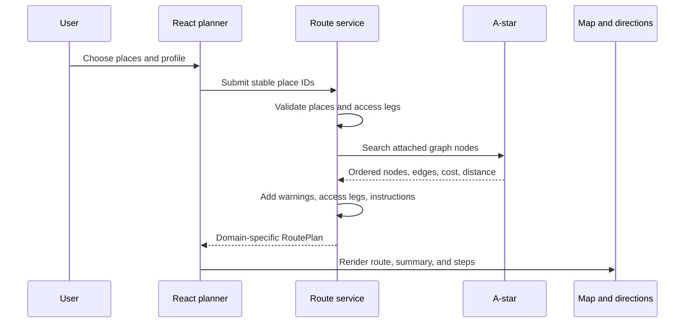

# Current System Architecture

## System shape

Shinjuku Indoor Navigator is a static React application backed by deterministic, preprocessed MLIT indoor-map data. The browser does not parse shapefiles and the renderer does not invent walkable topology.

```text
immutable MLIT shapefiles
  → TypeScript inspection/import scripts
  → validated processed JSON
  → framework-independent graph and route services
  → React planner state
  → Three.js map plus semantic HTML controls
  → Vite production build
  → Nginx container
```

The most important architectural rule is that five concerns stay separate:

1. Source geometry and attributes describe the station data.
2. The official pedestrian network describes routable topology.
3. Named places describe user-facing destinations and their explicit access legs.
4. The reviewed translation overlay describes localized display/search text without changing place identity.
5. Three.js describes presentation only.

## Repository layers

### Source and generation

- `shapefile/` is the expected location for immutable, ignored, local-only source data and is never committed or shipped.
- `data/` contains project-authored reviewed topology, translation sources, and source manifests.
- `scripts/` inspects, converts, validates, and deterministically regenerates browser data.
- `public/data/processed/` contains the complete runtime asset set.
- `reports/` contains audit and validation evidence.

`scripts/build-all-data.ts` is the pipeline coordinator. `scripts/check-generated-data.ts` rebuilds registered artifacts in a temporary directory and byte-compares them with the committed outputs.

### Runtime data boundary

- `src/schema/processed.ts`, `src/schema/reviewedCustomNetwork.ts`, and `src/schema/placeTranslations.ts` validate every fetched dataset before use.
- `src/data/loadMapData.ts` fetches processed files in parallel.
- `src/hooks/useMapData.ts` exposes loading, error, and ready states and cancels stale requests.

Invalid schema versions, malformed geometry, duplicate identifiers, or broken graph references fail at the boundary rather than becoming renderer errors.

### Graph and routing domain

- `src/graph/` builds plain TypeScript routing graphs from official and separately reviewed data.
- `src/routing/pathfinding.ts` implements Dijkstra and admissible A* plus routing profiles.
- `src/routing/routeService.ts` turns place IDs into explicit domain outcomes: `ok`, `invalid-place`, `outside-coverage`, or `unreachable`.
- `src/routing/routeInstructions.ts` converts edge traversal into locale-independent semantic steps.

This layer imports neither React nor Three.js. Tests can therefore prove directionality, accessibility policy, cost, optimality, and instructions without a browser.

### Application state and UI

- `src/features/route-planner/useRoutePlanner.ts` owns editable and submitted route requests and URL synchronization.
- `src/hooks/useViewerNavigation.ts` owns floor visibility, camera view state, and route-step focus.
- `src/hooks/useMapDisplayPreferences.ts` owns layer and facility-marker preferences.
- `src/hooks/useMapInteractionMessage.ts` owns transient map feedback.
- `src/i18n/LocaleProvider.tsx` owns the `en`/`ja` UI locale, versioned browser persistence, and the document language.
- `src/i18n/catalogs/` contains compile-time-aligned UI catalogs; `src/i18n/formatters.ts` turns route steps, warnings, floors, categories, and estimates into localized presentation text.
- `src/components/FloorViewer.tsx` is the composition root that connects these view models.
- `src/components/ViewerControls.tsx` and the smaller toolbar/sheet/legend components provide accessible controls.

Stable place IDs and the route profile are encoded in the URL. Graph node IDs remain an internal detail.

Locale is deliberately not encoded in route URLs. Changing language rerenders the existing semantic `RoutePlan`; it does not submit the planner, rerun A*, replace endpoint IDs, or alter geometry. Application catalogs localize UI grammar, while the generated translation overlay supplies reviewed/specification place and area display values. Japanese remains authoritative and missing English is shown as an explicit Japanese fallback. The bilingual search index includes both languages regardless of the active locale.

### Map presentation

- `src/map/MapScene.tsx` composes floor, space, fixture, structure, network, route, and marker layers.
- Facility-marker candidates are prepared once by the viewer and shared with the scene and legend.
- Repeated geometry uses merged meshes, instancing, and GPU line primitives.
- The selected route appears in both the 3D scene and a camera-projected SVG overlay.

Floor extrusion, wall height, floor spacing, opacity, and camera orientation never alter route topology or cost.

### Delivery

- Vite produces relative asset URLs and hashed application bundles.
- `Dockerfile` performs a reproducible multi-stage build.
- `deploy/nginx.conf` serves the SPA on port 8080 with fallback routing, compression, cache policies, a health endpoint, and security headers.
- `scripts/verify-container.ts` checks health, SPA fallback, headers, processed data, and raw-source exclusion.

## Runtime route flow



## Coordinate and accessibility policies

Source JGD2011 longitude/latitude is converted deterministically around the documented Shinjuku origin. Runtime units are metres with X east, Y vertical, and Z south.

Accessibility is conservative:

- known-inaccessible edges are excluded from accessible routing;
- unknown fields remain unknown and generate warnings;
- preference profiles are cost/filter views and never mutate official data;
- reviewed topology remains visibly separate from MLIT-derived topology.

## Automated quality gates

- `npm run build` — strict TypeScript plus the production Vite build.
- `npm run lint` — ESLint, including React hook rules.
- `npm test` — Vitest unit and integration tests.
- `npm run test:coverage` — targeted thresholds for schema, graph, and routing code.
- `npm run test:e2e` — desktop and mobile Chromium journeys.
- `npm run data:inspect` — source inventory evidence; requires the local raw package.
- `npm run data:check` — byte-identical generated-output verification; requires the local raw package.
- `npm run release:verify` — deployed asset, size, performance, schema, and raw-file checks.
- `npm run audit:prod` — production dependency vulnerability gate.
- `npm run docker:build` and `npm run container:verify` — production server verification.

CI enforces these in application, browser, and container jobs. Dependabot checks npm packages weekly and GitHub Actions monthly.

`npm run release:verify` also writes the untracked `reports/current-release-status.md` page from the current artifact so live counts and measurements do not have to be copied into long-lived architecture documents.
