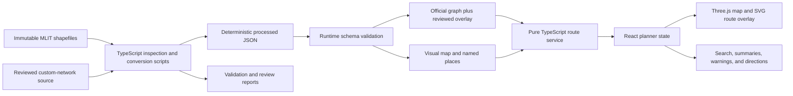
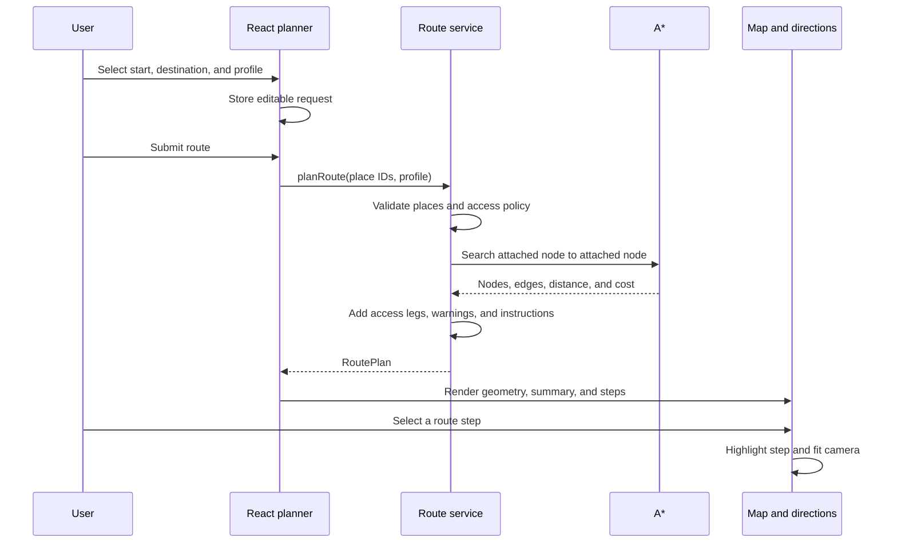

# Shinjuku Indoor Navigator — Design and Implementation Review

**Review date:** 27 July 2026

**Review scope:** Current implementation, including the reviewed custom-network overlay

**Audience:** Junior developers who want to understand how to design and build this project from the beginning

## 1. Executive summary

Shinjuku Indoor Navigator is a static web application that turns the Ministry of Land, Infrastructure, Transport and Tourism (MLIT) Shinjuku indoor-map shapefiles into a searchable, multi-floor 3D route planner.

The most important design decision is that the browser does **not** read shapefiles and does **not** invent routes from visible floor polygons. Instead:

1. Node.js/TypeScript scripts inspect and convert the immutable GIS source.
2. The scripts generate deterministic, browser-ready JSON.
3. Runtime parsers validate that JSON before the application uses it.
4. A plain TypeScript graph layer adapts the official pedestrian network.
5. A* calculates routes independently from React and Three.js.
6. React manages interaction and route-planning state.
7. React Three Fiber and Three.js render the station, route, facilities, and debug layers.

This is a sound architecture for a data-heavy map application. It protects routing correctness, keeps expensive GIS work out of the browser, and makes the critical domain logic easy to test.

### Current implementation status

The application portion is mature and verified:

- 241 valid shapefile groups are inventoried.
- The complete official network contains 1,982 nodes and 2,541 links.
- The current network is one connected component with no isolated nodes or invalid references.
- The visual map contains 4,387 features across eight normalized floors.
- The current place dataset contains 584 places, of which 583 are routable.
- A separate reviewed overlay adds 6 nodes, 7 edges, and 3 reviewed place attachments without changing the official dataset.
- Five routing profiles are implemented.
- Search, map selection, URL sharing, route instructions, multi-floor rendering, accessibility warnings, debug layers, and responsive controls are implemented.
- Build, lint, all 172 unit/integration tests, deterministic data regeneration, targeted coverage, real-browser journeys, production dependency auditing, release verification, and container verification pass.

The review recommendations were implemented on 26 July 2026. The project now includes reproducible Docker packaging and a verified Nginx delivery boundary. Deployment to a specific public host remains an operational action outside this repository, while the application artifact is deployment-ready.

> **Application, quality gates, and production packaging complete; public-host rollout is environment-specific.**

## 2. What problem the project solves

An indoor station navigator has three different problems that must not be confused:

1. **What does the station look like?**

   Floor, Space, Fixture, Opening, Drawing, Facility, and tactile-guidance data answer this.

2. **Where is a person allowed to walk?**

   The official `Shinjuku_node` and `Shinjuku_link` pedestrian network answers this.

3. **How does a person ask for a destination?**

   Named places and explicit place-to-network access legs answer this.

Visible polygons are not automatically a routing graph. Two shapes can overlap on screen while belonging to different floors, restricted areas, or disconnected facilities. This project correctly treats visual geometry, routing topology, and user-facing places as separate datasets that share one coordinate system.

The route contract is:

```text
start place
    → explicit access leg
    → reviewed custom endpoint overlay, only when specifically approved
    → official pedestrian network
    → explicit access leg
    → destination place
```

Tactile walking-surface indicator data (TWSI) remains a visual/debug layer. It is not used as the general pedestrian graph.

## 3. System architecture



### Dependency direction

The application mostly follows this dependency direction:

```text
React components
    ↓
hooks and route-planner feature
    ↓
route service
    ↓
pathfinding and graph types

Three.js presentation
    ↓
plain processed geometry and route results

Node.js data scripts
    ↓
shared coordinate rules and runtime schemas
```

The routing layer does not import React, the DOM, React Three Fiber, or Three.js. This is one of the strongest aspects of the design.

## 4. Repository map

| Path | Responsibility |
| --- | --- |
| `shapefile/` | Ignored local-only location for immutable MLIT source shapefiles and companion files |
| `data/` | Project-authored source metadata and reviewed topology |
| `scripts/` | Dataset inspection, conversion, validation, report generation, and release checks |
| `public/data/processed/` | Browser-ready generated JSON |
| `reports/` | Machine-readable validation, coverage, review, and golden-route evidence |
| `src/schema/` | Runtime validation and canonical processed-data contracts |
| `src/graph/` | Framework-independent routing graph construction and validation |
| `src/routing/` | A*, Dijkstra, route outcomes, instructions, and journey estimates |
| `src/features/route-planner/` | Search, URL state, and React route-planner state |
| `src/map/` | Three.js geometry and map-presentation logic |
| `src/components/` | Accessible planner, toolbar, legend, route sheet, and viewer composition |
| `tests/` | Data, graph, routing, presentation, and component tests |
| `docs/` | Project plan, phase reports, data rules, UI guidance, and this review |

## 5. Core data model

### 5.1 Coordinates

The source uses JGD2011 longitude and latitude. Routing and Three.js cannot safely use geographic degrees as distances, so preprocessing converts coordinates to local metres around a fixed Shinjuku origin:

- X: east in metres
- Y: vertical elevation in metres
- Z: south in metres

This convention is centralized in:

- `src/data/coordinates.ts`
- `src/data/floors.ts`

The browser map, route graph, access legs, markers, and generated geometry all use the same convention.

Display-only heights are deliberately separate from routing elevations. For example, stacked-floor gaps, wall envelopes, floor skirts, and fixture heights make the 3D map readable but never change route distance or graph topology.

### 5.2 Official network

`OfficialNetworkDataset` contains:

- source/provenance metadata;
- selected floors and ordinals;
- normalized nodes;
- normalized links;
- direction, movement kind, source distance, geometry distance, and source fields;
- network statistics.

The canonical contract and parser are in `src/schema/processed.ts`.

### 5.3 Routing graph

`src/graph/types.ts` defines plain serializable structures:

- `GraphNode`
- `GraphEdge`
- `RoutingGraph`
- accessibility state
- directed adjacency lists

`src/graph/buildOfficialGraph.ts` converts processed official data into this graph and:

- preserves source IDs;
- preserves one-way direction;
- creates reverse adjacency entries only for traversable reverse directions;
- falls back to measured geometry distance when a physical source link reports zero distance;
- derives conservative accessibility state from confirmed MLIT fields.

### 5.4 Reviewed custom overlay

Some named gates need a human-reviewed connection that is not represented by the official endpoint topology. The project keeps these exceptions separate:

- authored source: `data/reviewed-custom-network.source.json`
- generated runtime data: `public/data/processed/shinjuku-reviewed-custom-network.json`
- schema: `src/schema/reviewedCustomNetwork.ts`
- graph adapter: `src/graph/buildReviewedCustomGraph.ts`

The overlay cannot overwrite official IDs, cannot create cross-floor edges, must match measured geometry, must remain accessibility-unknown until surveyed, and must carry explicit review metadata.

This separation is much safer than editing generated official data.

### 5.5 Named places and access legs

A user selects a place, not a graph-node UUID. Each `NamedPlaceRecord` contains:

- stable place and source IDs;
- Japanese source name and searchable aliases;
- category, facility, floor, and coordinates;
- whether the place is routable;
- the attached graph node;
- attachment distance and geometry;
- confidence and review state;
- access accessibility;
- connected-component ID.

The access leg is included in both displayed geometry and total route distance.

## 6. How to design and implement the project from scratch

The safest implementation sequence is data-first. A junior developer should resist starting with the 3D viewer because a beautiful map is not evidence that routing is correct.

### Step 1 — Define product scope and non-goals

Start with one small, recognizable journey rather than the whole station.

Define:

- target dataset and version;
- first facility/floor slice;
- supported route profiles;
- supported destination categories;
- performance and payload budgets;
- explicit non-goals such as live congestion, AR, outdoor routing, or automatic accessibility inference.

Write these decisions before implementation. In this repository the durable workflow and current boundaries live mainly in:

- `docs/DEVELOPMENT.md`
- `docs/ARCHITECTURE.md`
- `docs/DATA_MODEL.md`

### Step 2 — Scaffold the engineering foundation

Create a Vite + React + strict TypeScript project.

Add:

- React Three Fiber, Three.js, and Drei for 3D rendering;
- Vitest and React Testing Library;
- ESLint with React Hooks rules;
- CI using `npm ci`, build, lint, tests, and deterministic data checks.

Keep the first scene trivial. The goal is only to prove that TypeScript, React, WebGL, tests, linting, and production builds work together.

Relevant files:

- `src/main.tsx`
- `src/app/App.tsx`
- `src/components/SmokeTestScene.tsx`
- `vite.config.ts`
- `vitest.config.ts`
- `eslint.config.js`
- `.github/workflows/ci.yml`

### Step 3 — Audit the source dataset

Before importing geometry, enumerate every `.shp` group and verify its companion files.

For each group record:

- geometry type;
- record count;
- DBF fields;
- encoding;
- coordinate reference system;
- bounds;
- facility and floor;
- warnings and checksums.

Confirm whether an authoritative Node/Link routing network exists. If it does not, pause and make a human decision: obtain another source, author a small reviewed graph, design a separate graph-derivation method, or continue as a viewer only.

Implementation:

- `scripts/inspect-dataset.ts`
- `scripts/data/shapefile.ts`
- `reports/dataset-inspection.json`
- `data/source-manifest.json`

### Step 4 — Establish coordinate and floor rules

Choose a stable local origin and document the axes once.

Implement pure functions for:

- longitude/latitude to local metres;
- floor-name normalization;
- source ordinal to floor ID;
- routing elevation.

Test known points and never mix degree coordinates with metre-based costs.

Implementation:

- `src/data/coordinates.ts`
- `src/data/floors.ts`
- coordinate and phase-data tests

### Step 5 — Define processed schemas before writing importers

Design browser-friendly, JSON-serializable contracts for:

- visual features;
- official nodes and links;
- places and access legs;
- reviewed topology;
- statistics and provenance.

Then write runtime parsers that reject:

- unsupported schema versions;
- duplicate IDs;
- invalid node references;
- malformed geometry;
- wrong units or axes;
- floor mismatches;
- access legs that do not end at their attached node;
- statistics that disagree with array counts.

Implementation:

- `src/types/processed.ts`
- `src/schema/processed.ts`
- `src/schema/reviewedCustomNetwork.ts`

### Step 6 — Build a deterministic visual-data converter

For each selected visual layer:

1. Read SHP geometry and DBF properties.
2. Normalize the floor.
3. Convert every point to local metres.
4. Preserve original source IDs and relevant properties.
5. Sort features and property keys.
6. use a fixed generated timestamp;
7. include input checksums and importer version.

Identical input must produce byte-identical output.

The project first built a small B1 slice and later generalized this to the full visual map:

- `scripts/convert-dataset.ts`
- `scripts/build-full-map.ts`
- `public/data/processed/shinjuku-full-map.json`

### Step 7 — Import and validate the official pedestrian network

Read `Shinjuku_node` and `Shinjuku_link`, then:

1. Preserve official node/link IDs.
2. Resolve every endpoint reference.
3. Normalize floors from ordinals.
4. Orient each link geometry from source start to source end.
5. preserve direction and movement codes;
6. convert geometry to local metres;
7. compare source distance with measured geometry distance;
8. count components, isolated nodes, one-way links, and cross-floor links;
9. reject invalid topology.

Implementation:

- `scripts/import-official-network.ts`
- `scripts/validate-official-network.ts`
- `reports/official-network-validation.json`

The current result is valid: 1,982 nodes, 2,541 links, 253 cross-floor links, one connected component, and no isolated nodes.

### Step 8 — Build the framework-independent graph

Convert processed nodes and links into:

```text
nodes[]
edges[]
adjacency[nodeId] → outgoing edges[]
```

Normalize reverse traversal by creating reverse adjacency entries with:

- swapped endpoints;
- reversed geometry;
- swapped floor metadata;
- the same source edge identity for route reporting.

Keep this code independent of React and Three.js.

Implementation:

- `src/graph/types.ts`
- `src/graph/buildOfficialGraph.ts`
- `src/graph/validateGraph.ts`

### Step 9 — Implement Dijkstra first, then A*

Dijkstra is the simple correctness oracle. A* is the optimized production search.

Both algorithms:

- use the same eligibility rules;
- use the same edge-cost function;
- return node IDs, edge IDs, physical distance, and profile cost;
- use deterministic queue ordering.

The A* heuristic is:

```text
straight-line distance to goal × safe heuristic scale
```

The scale is the smallest eligible edge-cost-to-straight-distance ratio in the graph. That keeps the heuristic admissible even when source costs and geometry lengths differ.

Tests compare A* with Dijkstra on fixtures and representative full-network routes.

Implementation:

- `src/routing/pathfinding.ts`
- `src/routing/benchmark.ts`
- `tests/routing.test.ts`
- `tests/human-golden-route.test.ts`

### Step 10 — Add route profiles without mutating topology

Profiles are cost/filter views over one graph:

- **Shortest:** physical link distance.
- **Wheelchair accessible:** exclude known-inaccessible edges; permit unknown edges with warnings.
- **Avoid stairs:** exclude stair edges.
- **Prefer elevators:** add a dominating penalty to non-elevator floor transitions.
- **Fewest floor changes:** add a dominating penalty to every floor transition.

Unknown does not mean accessible. The UI must disclose which source fields are incomplete.

### Step 11 — Build named destinations

Convert source-backed gates, connectors, and facilities into understandable places.

For each place:

1. Compute a deterministic representative point.
2. Find the nearest suitable same-floor graph node.
3. Record the measured access leg.
4. classify confidence;
5. keep low-confidence records out of normal routing;
6. preserve Japanese source names;
7. add only specification-backed aliases or deterministic category labels;
8. use a reviewed overlay only for explicitly approved endpoint exceptions.

Implementation:

- `scripts/build-named-places.ts`
- `src/map/facilityMarkers.ts`
- `public/data/processed/shinjuku-b1-named-places.json`

### Step 12 — Orchestrate the complete data build

Run every generator in dependency order:

```text
inspect
→ convert bounded fixture
→ validate fixture
→ profile semantics
→ profile vertical links
→ import official network
→ validate network
→ build reviewed overlay
→ build full visual map
→ build named places
→ build marker review
→ build golden route
```

`scripts/build-all-data.ts` owns this order.

`scripts/check-generated-data.ts` rebuilds all registered artifacts in a temporary directory and byte-compares them with committed outputs. Run it through `npm run data:check` when the ignored local source package is available; clean-clone CI uses `npm run release:verify` to validate committed runtime assets.

### Step 13 — Load and validate data in the browser

The browser fetches processed JSON in parallel, validates each dataset, and exposes a discriminated loading state:

```text
loading | error | ready
```

An `AbortController` cancels loading if the component unmounts.

Implementation:

- `src/data/loadMapData.ts`
- `src/hooks/useMapData.ts`

### Step 14 — Add route-planner state

Keep editable form state separate from the submitted route request. This lets a user change fields without immediately replacing the visible route.

State includes:

- start;
- destination;
- routing profile;
- last submitted request;
- dirty state;
- calculated `RoutePlan`.

The URL stores stable place IDs and the profile, not graph-node IDs. `popstate` restores browser back/forward navigation.

Implementation:

- `src/features/route-planner/useRoutePlanner.ts`
- `src/features/route-planner/routeUrlState.ts`
- `src/features/route-planner/placeSearch.ts`

### Step 15 — Return domain-specific route outcomes

Do not return only `route | null`. `src/routing/routeService.ts` returns explicit outcomes:

- `ok`
- `invalid-place`
- `outside-coverage`
- `unreachable`

For valid routes it adds:

- access legs;
- total journey distance;
- accessibility warnings;
- ordered instructions;
- traversed geometry.

This gives the UI enough information to explain a failure accurately.

### Step 16 — Generate route instructions

Convert low-level edge sequences into human-readable steps:

1. Start access leg.
2. Group consecutive same-kind, same-floor edges.
3. Merge heading changes of at most 20 degrees.
4. Identify left/right turns from signed heading change.
5. Name stairs, escalators, elevators, and floor transitions.
6. Add the final access/arrival step.

Implementation:

- `src/routing/routeInstructions.ts`
- `src/routing/journeyEstimate.ts`

### Step 17 — Build the 3D map as presentation layers

`src/map/MapScene.tsx` composes separate layers:

1. floor slabs;
2. semantic space surfaces;
3. fixtures;
4. wall envelopes;
5. outlines and openings;
6. structural Drawing lines;
7. outdoor-source outlines;
8. optional official network;
9. debug TWSI and node IDs;
10. route and transition geometry;
11. facilities, places, and endpoint markers.

Performance techniques include:

- merged extruded geometry;
- instanced direction arrows;
- GPU wide-line segments;
- on-demand rendering;
- memoized derived geometry;
- explicit disposal of Three.js resources;
- a separate Three.js chunk;
- debug-only rendering for thousands of node labels.

### Step 18 — Keep the route visible

The route is rendered twice:

- wide GPU lines in the 3D scene;
- a camera-projected SVG overlay above WebGL.

The 3D layer establishes correct spatial placement. The SVG layer keeps the same-floor route visible over complex station geometry.

Route geometry respects visible floors:

- same-floor lines require that floor to be visible;
- transitions require both endpoint floors;
- unrelated route floors are rendered as context.

Implementation:

- `src/map/routeLineGeometry.ts`
- `src/map/RouteScreenOverlay.tsx`
- `src/map/MapScene.tsx`

### Step 19 — Add an accessible map-first interface

The interface uses semantic HTML around the WebGL map:

- keyboard comboboxes;
- labelled regions;
- buttons with pressed/checked state;
- floor radio/checkbox behavior;
- visible focus indicators;
- live route and interaction messages;
- route warnings;
- keyboard-native disclosure widgets;
- human-readable labels instead of graph IDs.

Main components:

- `src/components/FloorViewer.tsx`
- `src/components/ViewerControls.tsx`
- `src/components/MapToolbar.tsx`
- `src/components/RouteSheet.tsx`
- `src/components/MapLegend.tsx`

### Step 20 — Verify the release boundary

The release verifier checks:

- successful production build;
- repository-relative asset paths;
- exact processed-asset inventory;
- runtime parsing of release data;
- representative route latency;
- processed-data and JavaScript size budgets;
- absence of raw `.shp`, `.shx`, `.dbf`, `.prj`, and `.cpg` files.

The deployment implementation now includes:

- a multi-stage Dockerfile using Node 22 for the build and Nginx for runtime;
- a `.dockerignore` that excludes source GIS data and development artifacts;
- SPA fallback, cache, compression, security-header, and raw-GIS denial rules;
- container health and serving verification;
- CI browser, dependency, coverage, and container gates.

## 7. Runtime flow for one route



## 8. Testing and verification strategy

The test suite is broad and sensibly layered.

### Data and schemas

- shapefile inspection;
- deterministic generated-data checks;
- coordinate/floor conversion;
- full-map generation;
- official-network import and validation;
- reviewed-network schema;
- named-place generation and access legs.

### Routing

- Dijkstra and A* correctness;
- one-way edges;
- disconnected graphs;
- equal-cost alternatives;
- accessibility profiles;
- heuristic admissibility;
- golden real-data routes;
- route-service outcomes;
- route instructions and journey estimates.

### Presentation

- map bounds and camera fit;
- stacked elevations;
- route visibility and transition geometry;
- space/fixture semantics;
- wall envelopes;
- facility-marker selection;
- legend composition;
- URL state;
- planner and toolbar interactions.

### Verified during this review

| Check | Result |
| --- | --- |
| `npm run build` | Passed; 645 modules transformed |
| `npm run lint` | Passed with no findings |
| `npm test` | Passed; 40 files and 172 tests |
| `npm run data:check` | Passed; 14 registered artifacts reproduced byte-for-byte |
| `npm run release:verify` | Passed |
| Release size | 11 files, 9.43 MB |
| Processed browser data | 6 files, 8.17 MB; budget 10 MB |
| Largest JavaScript chunk | 718.1 kB; budget 1,000 kB |
| Representative A* route | Below 1 ms average in current runs; budget 100 ms |
| Raw GIS files in `dist/` | None |
| Production dependencies | 0 known vulnerabilities |

The build reports a Vite warning because the Three.js chunk is larger than Vite's default 500 kB advisory threshold. It still passes the project's explicit 1,000 kB limit.

## 9. What is designed well

### 9.1 Correct domain boundaries

Routing, source data, user places, and rendering are separate. This avoids the most dangerous indoor-map mistake: treating visible geometry as authoritative walkable topology.

### 9.2 Deterministic data engineering

Fixed timestamps, stable ordering, checksums, temporary rebuilds, and byte comparisons make generated artifacts reviewable and reproducible.

### 9.3 Runtime validation

The application does not blindly cast fetched JSON. It checks versions, geometry, units, IDs, references, floors, counts, and access-leg consistency before graph construction.

### 9.4 Conservative accessibility

Known-inaccessible links are excluded. Unknown fields remain unknown and produce route warnings. Preference profiles do not mutate the official graph.

### 9.5 Correctness-first pathfinding

Dijkstra is retained as an oracle, while A* uses a data-derived admissible scale. Tests compare both algorithms on real data.

### 9.6 Explicit reviewed exceptions

Human-approved topology is stored and validated separately instead of being disguised as MLIT data.

### 9.7 Map performance

The renderer uses merged geometry, GPU line primitives, instancing, lazy loading, on-demand frames, and disposal of graphics resources. Current measured budgets pass comfortably.

### 9.8 Accessible public language

The user selects named places, sees floors and movement types, and receives explicit route outcomes. Raw IDs are limited to debug mode.

## 10. Current review findings

The original release-engineering and maintainability findings are resolved:

- every deployed processed asset belongs to the deterministic build contract;
- Docker/Nginx delivery, health checks, security headers, and container verification are implemented;
- architecture and operational documentation describe the current application;
- malformed-network validation produces actionable diagnostics;
- viewer state is separated into focused hooks;
- facility-marker candidates are computed once and shared;
- browser and targeted coverage gates exist;
- the unused state dependency was removed.

Remaining improvements are presentation and maintenance refinements, not release blockers:

1. Make facility-marker density respond to an active route, not only zoom and selected categories.
2. Make dense marker collections more efficient for keyboard users through roving focus or a synchronized non-spatial facility list.
3. Keep visible, focused, selected, and route-used floor states unambiguous.
4. Investigate safe splitting or lazy loading for the advisory-size Three.js chunk.
5. Promote the remaining technical Japanese translation fallbacks only with authoritative or human-reviewed evidence.

The maintained acceptance criteria are in `docs/ROADMAP.md`.

## 11. Suggested next implementation order

1. Route-focused marker prioritization and clustering.
2. Keyboard-efficient facility discovery.
3. Floor-control semantics and browser coverage.
4. Viewer delivery-size investigation.
5. Evidence-backed translation promotion.

## 12. Junior-developer reading order

Read the project in this order:

1. `README.md` and `docs/README.md` — product and documentation map.
2. `docs/DEVELOPMENT.md` — safe implementation workflow.
3. `docs/ARCHITECTURE.md` — current system boundaries.
4. `docs/DATA_MODEL.md` — coordinate, source, graph, place, and translation rules.
5. `src/schema/processed.ts` — the runtime data contract.
6. `scripts/build-all-data.ts` — the preprocessing pipeline.
7. `scripts/import-official-network.ts` — how source topology becomes processed data.
8. `src/graph/types.ts` and `src/graph/buildOfficialGraph.ts` — runtime graph shape.
9. `src/routing/pathfinding.ts` — Dijkstra, A*, and route profiles.
10. `src/routing/routeService.ts` — place-to-place route outcomes.
11. `src/features/route-planner/useRoutePlanner.ts` — browser state and URL behavior.
12. `src/components/FloorViewer.tsx` — application composition.
13. `src/map/MapScene.tsx` — 3D presentation layers.
14. Relevant tests beside each module.

Do not begin with `MapScene.tsx`. It is easier to understand after learning the data contracts and route flow.

## 13. Common mistakes to avoid

- Do not edit or commit anything under `shapefile/`.
- Do not put raw GIS files under `public/`.
- Do not edit generated JSON manually.
- Do not infer a route from visual polygons.
- Do not use TWSI as the general pedestrian graph.
- Do not connect overlapping shapes across floors.
- Do not treat unknown accessibility as confirmed accessible.
- Do not let 3D floor spacing alter route cost.
- Do not expose graph IDs as normal destination names.
- Do not add reviewed connections to the official artifact.
- Do not accept an importer change without deterministic regeneration and validation.
- Do not call deployment complete until the actual container/server is verified.

## 14. Practical commands

```bash
npm install
npm run dev
npm run build
npm run lint
npm test
npm run data:inspect
npm run data:build
npm run data:check
npm run release:verify
```

Use `data:build` only when intentionally regenerating tracked artifacts. Use `data:check` for a non-mutating reproducibility check because it rebuilds into a temporary directory. Both require the ignored local raw source package; clean public clones should use `release:verify`.

## 15. Final assessment

The project is thoughtfully engineered and unusually disciplined about GIS provenance, routing authority, accessibility uncertainty, deterministic output, and separation from rendering. The graph and route layers are the strongest parts of the implementation, and the current automated verification provides good evidence that the working application is stable.

The original release-engineering and maintainability findings have been remediated: the obsolete asset is removed, current documentation and generated release status are in place, the container is verified, browser and coverage gates are enforced, viewer state is separated into focused hooks, marker preprocessing is shared, malformed-network reports remain actionable, and the unused state dependency is gone.

The project now has a credible end-to-end story from immutable government source data to a reproducible, validated, deployable indoor navigation application.
